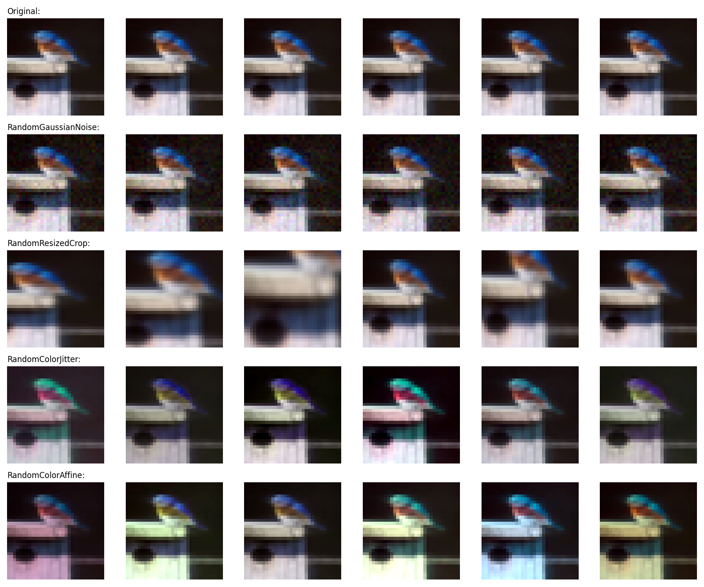
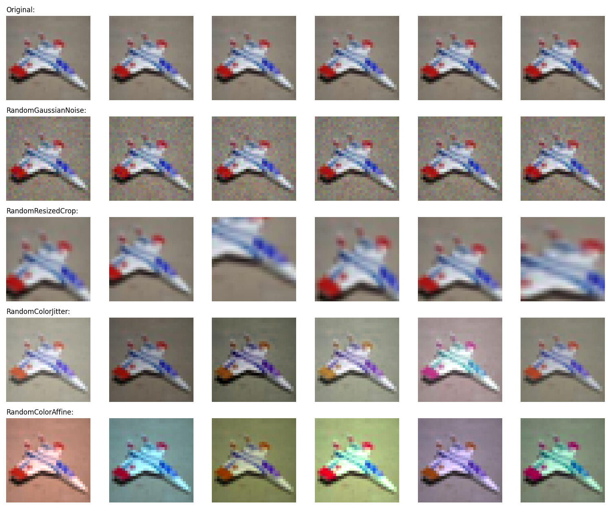

# Custom Image Augmentation Layers with Keras

This repository contains an implementation of 4 custom image augmentation layers:
- **RandomGaussianNoise**: applies additive normal-distributed pixel noise to the image with given standard deviation
- **RandomResizedCrop**: crops and resizes a part of the image with given aspect ratio and zoom range to its original resolution
- **RandomColorJitter**: distorts the color distibutions of images in torchvision-style
- **RandomColorAffine**: distorts the color distibutions of images by applying a random affine transformation in color space

Using custom Keras preprocessing layers for data augmentation has the following two advantages:
- the data augmentation will run on GPU in batches, so the training will not be
bottlenecked by the data pipeline in environments with constrained CPU resources (such
as a Colab Notebook, or a personal machine)
- deployment is easier as the data preprocessing pipeline is encapsulated in the model,
and does not have to be reimplemented when deploying it

## Usage: minimal example
``` python
import augmentations
import tensorflow as tf
import tensorflow_datasets as tfds

from tensorflow import keras
from tensorflow.keras import layers
from tensorflow.keras.layers.experimental import preprocessing

num_epochs = 10
batch_size = 64
width = 128

train_dataset = (
    tfds.load("cifar10", split="train", as_supervised=True, shuffle_files=True)
    .shuffle(10 * batch_size)
    .batch(batch_size)
    .prefetch(buffer_size=tf.data.AUTOTUNE)
)
test_dataset = (
    tfds.load("cifar10", split="test", as_supervised=True)
    .batch(batch_size)
    .prefetch(buffer_size=tf.data.AUTOTUNE)
)

model = keras.Sequential(
    [
        layers.Input(shape=(32, 32, 3)),
        preprocessing.Rescaling(1 / 255),
        augmentations.RandomColorJitter(),
        augmentations.RandomResizedCrop(),
        layers.Conv2D(width, kernel_size=3, strides=2, activation="relu"),
        layers.Conv2D(width, kernel_size=3, strides=2, activation="relu"),
        layers.Conv2D(width, kernel_size=3, strides=2, activation="relu"),
        layers.Flatten(),
        layers.Dense(10, activation="softmax"),
    ]
)
model.compile(
    optimizer="adam",
    loss="sparse_categorical_crossentropy",
    metrics=["sparse_categorical_accuracy"],
)
model.fit(train_dataset, epochs=num_epochs, validation_data=test_dataset)
```

## Visualizations


